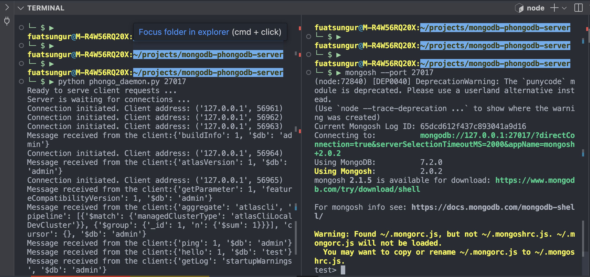

# MongoDB API Compatible Fake Database Server

PhongoDB, implemented in Python, is a MongoDB API Compatible Fake Database Server that implements the MongoDB Wire Protocol. 

Tested in below environment:
- mongosh 2.0.2
- Python 3.9.2

After you clone the repository:

- `$ python phongo_daemon.py 27017`
  - Make sure server is running
- Then connect from `mongosh`
  - `$ mongosh --port 27017`
 
 It's supported:
 - Very simple `insertMany()` and `insertOne()`
 - Very simple `find()` command with equality match (without `$eq` operator)
 - Very simple `updateOne()` command with `$set` operator
 - Very simple `aggregate([])` command with `$match` stage with equality (without `$eq` operator)
 - Very simple `deleteOne()` and `deleteMany()`

# How to run it

## 1. Run the server and then Run `mongosh`

On the left hand side of the screen, you see that `phongo_daemon.py` was run with the server port number. After we run the server, on the right hand side you see that we connected to the server from `mongosh`. 


## 2. Switch to the desired database 

Switch to the database.

```javascript
test> use db002
switched to db db002
db002> 
```

## 3. Insert the example json records into the customer collection

- Copy the content of `example_customers.json` file 
- Insert it into `customers` collection as shown in the below.

```javascript
db002> db.customers.insertMany([
    {
        "customer_name": "Fuat Sungur",
        "email": "afsungur@gmail.com",
        "balance": 760,
        "addresses": [
            {
                "type": "home",
                "address": "Jumeirah Village Triangle, Dubai"
            },
            {
                "type": "work",
                "address": "Dubai Internet City"
            }
        ]
    },
    {
        "customer_name": "John Wick",
        "email": "john.wick@gmail.com",
        "balance": 999,
        "addresses": [
            {
                "type": "home",
                "address": "Brooklyn, New York City"
            },
            {
                "type": "work",
                "address": "Manhattan, New York City"
            }
        ]
    },
    {
        "customer_name": "Walter White",
        "email": "walter.white@gmail.com",
        "balance": 99999,
        "addresses": [
            {
                "type": "home",
                "address": "Albuquerque"
            },
            {
                "type": "work",
                "address": "New Mexico"
            }
        ]
    }
])
```

Then we should receive the following message from the server:

```javascript
{
  acknowledged: true,
  insertedIds: {
    '0': ObjectId("65dcd9319d13622ebb437f34"),
    '1': ObjectId("65dcd9319d13622ebb437f35"),
    '2': ObjectId("65dcd9319d13622ebb437f36")
  }
}
```

## 4. Run a simple `find` command

```javascript
db002> db.customers.find({"customer_name":"Walter White"})
[
  {
    customer_name: 'Walter White',
    email: 'walter.white@gmail.com',
    balance: 99999,
    addresses: [
      { type: 'home', address: 'Albuquerque' },
      { type: 'work', address: 'New Mexico' }
    ],
    _id: ObjectId("65dcd9319d13622ebb437f36")
  }
]
db002> 
```

## 5. Insert a new record with write concern options 

Insert a new record into the customers collection with `writeConcern` option.

```javascript
db002> db.customers.insertOne({"customer_name": "Jesse Pinkman", "email":"jesse@gmail.com"},{"writeConcern": {"w": "majority", "j": true}})
{
  acknowledged: true,
  insertedId: ObjectId("65dcd9fd9d13622ebb437f37")
}
db002> 
```

There is no write concern implementations on the server, as you've seen, it was silently ignored.

## 6. Applying limit and skip

```javascript
db002> db.customers.find({}).limit(1).skip(1)
[
  {
    customer_name: 'Fuat Sungur',
    email: 'afsungur@gmail.com',
    balance: 760,
    addresses: [
      { type: 'home', address: 'Jumeirah Village Triangle, Dubai' },
      { type: 'work', address: 'Dubai Internet City' }
    ],
    _id: ObjectId("65dcd9319d13622ebb437f34")
  },
  {
    customer_name: 'John Wick',
    email: 'john.wick@gmail.com',
    balance: 999,
    addresses: [
      { type: 'home', address: 'Brooklyn, New York City' },
      { type: 'work', address: 'Manhattan, New York City' }
    ],
    _id: ObjectId("65dcd9319d13622ebb437f35")
  },
  {
    customer_name: 'Walter White',
    email: 'walter.white@gmail.com',
    balance: 99999,
    addresses: [
      { type: 'home', address: 'Albuquerque' },
      { type: 'work', address: 'New Mexico' }
    ],
    _id: ObjectId("65dcd9319d13622ebb437f36")
  },
  {
    customer_name: 'Jesse Pinkman',
    email: 'jesse@gmail.com',
    _id: ObjectId("65dcd9fd9d13622ebb437f37")
  }
]
db002> 
```

As you can see the resultset is not correct (limit and skip ignored and the result set is not the expected one).

## 7. Running an updateOne()

```javascript
db002> db.customers.updateOne({"customer_name": "Walter White"},{"$set":{"customer_name":"Heisenberg"}})
{
  acknowledged: true,
  insertedId: null,
  matchedCount: 1,
  modifiedCount: 1,
  upsertedCount: 0
}
db002> 
```

## 8. Running an unsupported update operator: `$inc`

```javascript
db002> db.customers.updateOne({"customer_name": "Heisenberg"},{"$inc": {"balance":1000}})
MongoServerError: Unrecognized update operator: '$inc'
db002> 
```

## 9. Running an aggregation query

```javascript
db002> db.customers.aggregate([{'$match': {'customer_name':'Fuat Sungur'}}]) 
[
  {
    customer_name: 'Fuat Sungur',
    email: 'afsungur@gmail.com',
    balance: 760,
    addresses: [
      { type: 'home', address: 'Jumeirah Village Triangle, Dubai' },
      { type: 'work', address: 'Dubai Internet City' }
    ],
    _id: ObjectId("65dcd9319d13622ebb437f34")
  }
]
db002> 
```

## 10. Running an unsupported aggregation stage: `$group`

```javascript
db002> db.customers.aggregate([{'$group': {'_id': null, 'cnt':{'$sum':1}}}]) 
MongoServerError: Unrecognized pipeline stage name: '$group'
db002> 
```

## 11. Delete one record from the collection

```javascript
db002> db.customers.deleteOne({"customer_name":"Fuat Sungur"})
{ acknowledged: true, deletedCount: 1 }
db002> 
```

## 12. Delete all the records in the collection

```javascript
db002> db.customers.deleteMany({})
{ acknowledged: true, deletedCount: 3 }
db002> 
```

